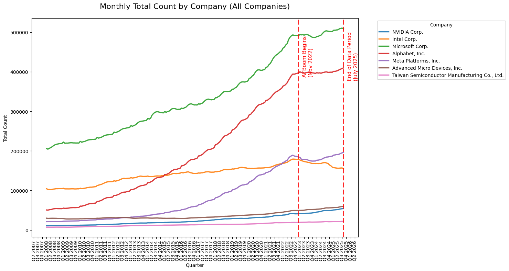
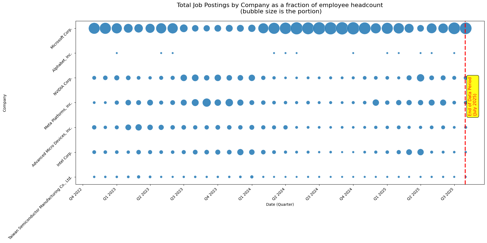
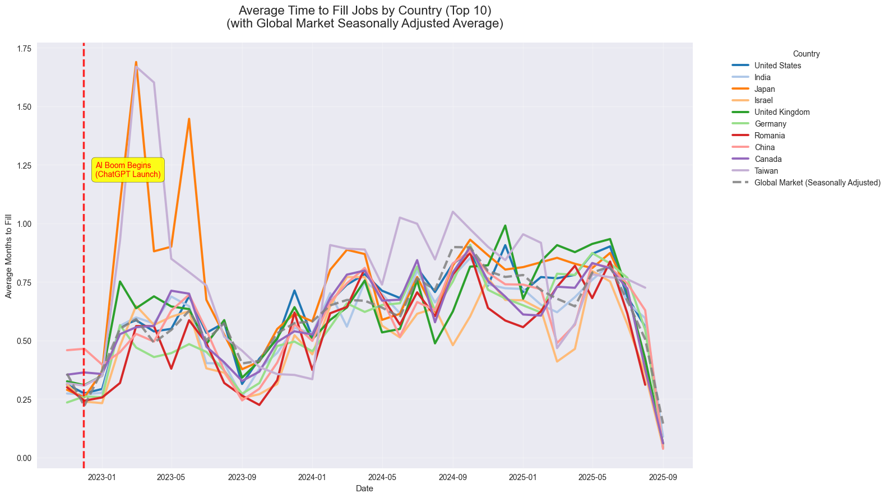
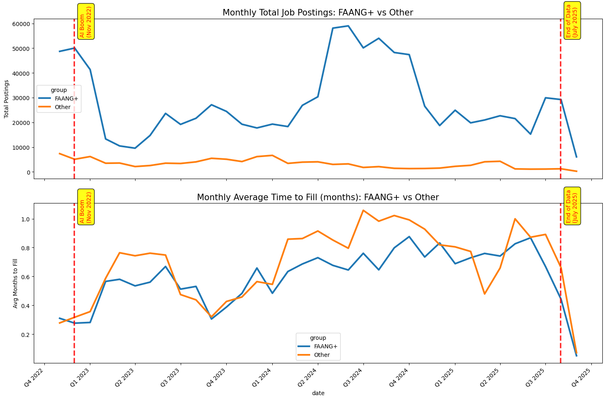
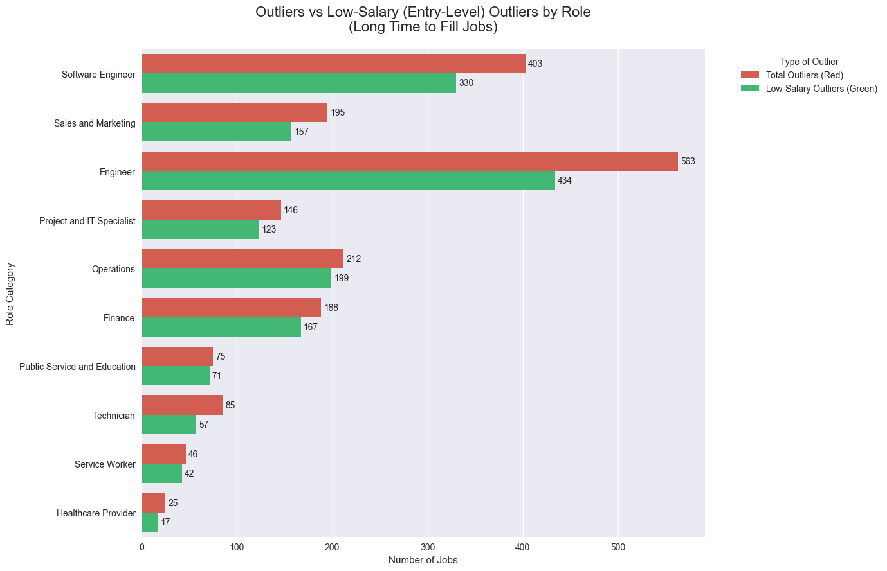

###### Revelio Labs Newsletter

## An insight from the inner circle of recruiting

***April 30, 2026***

##### Key Takeaways

- AI did **not** make hiring faster; in fact, average time-to-fill has increased across most roles since introduction of AI
- Major tech companies slowed headcount growth dramatically after the AI boom, but hiring intensity (postings per employee) varied significantly
- Roles that take unusually long to fill are overwhelmingly **low-salary / entry-level** positions
- Engineering and Software Engineering dominate postings but also show some of the longest filling times.

---

In one of our previous [newsletter pieces](https://www.reveliolabs.com/news/social/what-you-study-matters-more-than-where-you-study/), we discussed how **what** you study matters more than **where** you study. Today, we look at the other side of the table: how hiring trends have shifted inside big companies and what this means for recent graduates and job seekers.

When ChatGPT launched in late 2022, the expectation was simple: artificial intelligence would supercharge repetitive work; including HR and hiring. Companies were expected to post more jobs, fill roles faster, and expand at record speed.

The actual data, however, tells a very different story.

Right after the AI boom began, almost every major tech company suddenly slowed its headcount growth. The steady upward trend that had lasted for years flattened almost overnight.

Even in this slower environment, companies behaved differently. We call this metric **hiring intensity** — the number of job postings relative to total headcount.

Microsoft stood out by maintaining remarkably high hiring intensity throughout the period. Alphabet (Google’s parent company) took a more cautious, cyclical approach, keeping hiring intensity much more stable and even pausing during certain periods of the year.

Many companies had to balance two critical questions: stay ahead in AI development or move cautiously while figuring out the right strategy. Although the number of postings didn’t collapse, the time required to fill roles started changing noticeably.

----

##### What has been happening across the globe?

At a macro level, countries were also disrupted. Almost all top-10 countries (by job posting volume) experienced a sudden spike right after November 2022. This suggests AI changed the chemistry of hiring. However, average time-to-fill has continued to fluctuate, indicating that either AI is still not fully leveraged in recruitment, or the volume of hiring has scaled up so much that overall filling times remain elevated. We would evaluate this in the future.

---

Looking specifically at FAANG+ companies from the AI boom through July 2025, we see that while job postings fluctuated (especially in 2024), the **average time to fill** those jobs has been steadily increasing. Even non-tech companies, while more stable in their posting volume, have faced longer filling times.

---

##### What does this mean for us humans in the job market?

Although we are still early in AI adoption for everyday recruiting tasks, some clear patterns are emerging.

We analyzed job postings from late 2022( introduction of Chat GPT) to July 2025 across 10 major role categories (proprietary to Revelio Labs). We excluded four categories with very low volume (Healthcare, Technicians, Service Workers, and Education) because they often use specialized pipelines outside of standard job boards.

Among the remaining roles, nearly 73% of postings were in Engineering and IT-related categories. The rest were split between Marketing & Sales, Finance, and Operations.

**Roles that take unusually long to fill look different from the rest.** The hardest-to-fill positions consistently come with **lower salaries**. In other words, AI appears to be disproportionately affecting entry-level roles.

While the total number of unusually long-to-fill jobs remains small (less than 1% in each category), they exist and roughly 80% of them fall in the lower-paying tier.

---

##### Key Takeaway for Recent Graduates and Job Seekers

If you are a recent graduate in engineering or software engineering, expect longer application cycles than pre-AI norms. Some roles that once took weeks to fill may now take **two months or more** in extreme cases.

The job market is not disappearing; on the contrary, it is evolving and nderstanding these shifts gives you a real advantage as you navigate your next steps.

AI has not yet delivered the promised acceleration in hiring. Instead, it has created a more complex, slower, and more selective recruiting environment — especially for entry-level technical roles. Companies are being more deliberate, and the data shows that patience and strategic preparation will be essential for job seekers in the years ahead.

